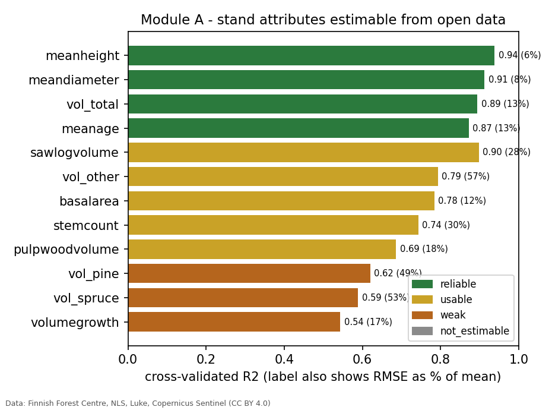
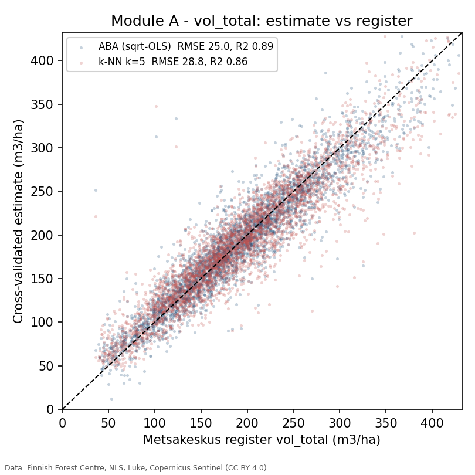
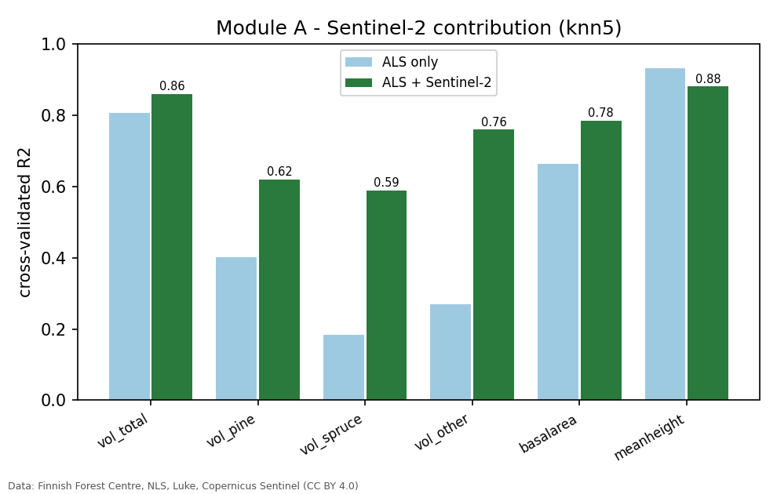
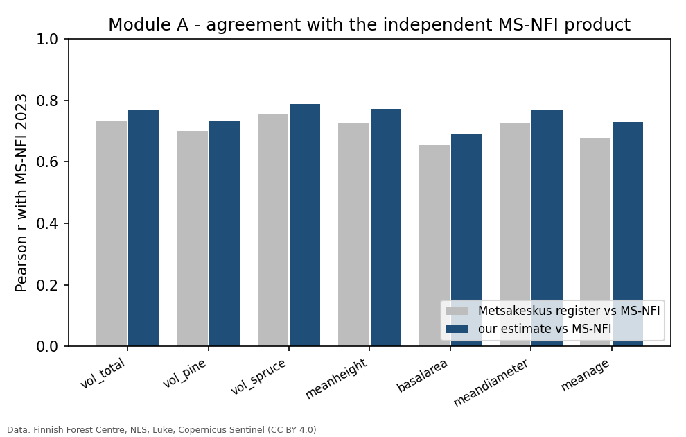
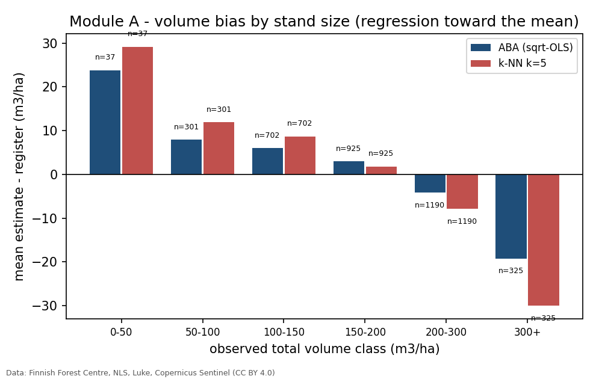
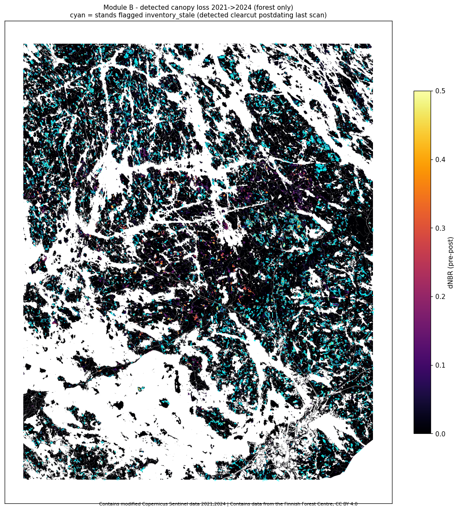
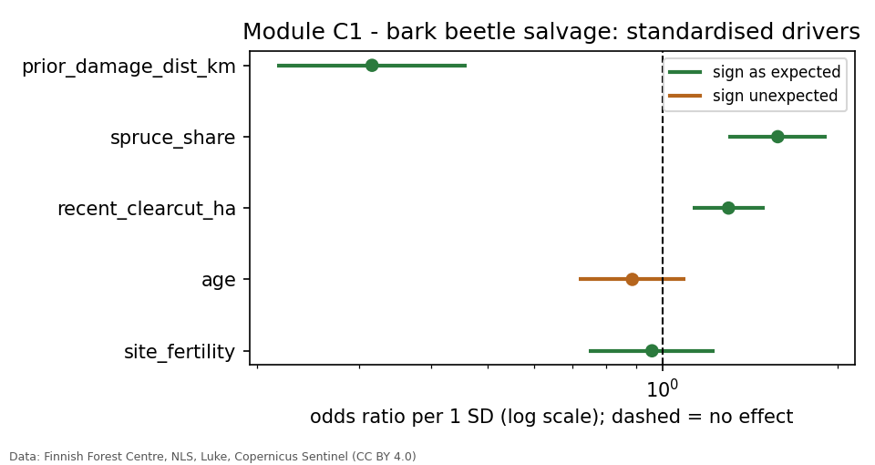
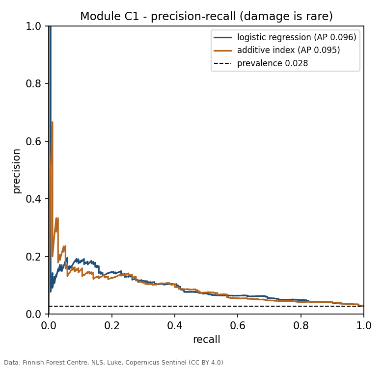
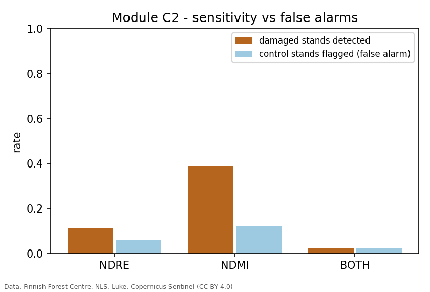
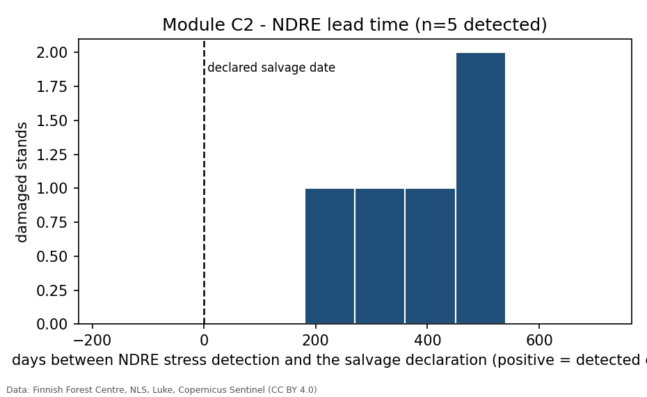

# Boreal Stand Intelligence

Rebuilding three geospatial data products used in operational Finnish forestry
from **open data only**, as a validated batch pipeline: **growing-stock
estimation** (Module A), **harvest change detection** (Module B), and
**bark-beetle susceptibility and stress detection** (Module C). Every method is a
documented operational method, transparent statistics, or a deterministic rule —
no black boxes. Project 1 of two; companion repo `regenerative-harvest-planning`.

**Area of interest:** south-east Finland (Puumala–Ruokolahti–Savonlinna),
EPSG:3067 `[553000, 6780000, 610000, 6851000]`, 57 × 71 km, ~4,047 km², mixed
pine–spruce (spruce ~28 % by volume). All processing in EPSG:3067.

---

## Data and method at a glance

| Source | Product | Tier | Used for |
|---|---|---|---|
| Finnish Forest Centre (Metsäkeskus) | stands, grid cells, forest-use declarations | FETCH / BENCHMARK | reference attributes, harvest & damage truth |
| NLS | 0.5 p airborne laser scanning, 2 m DEM | DERIVE input | ALS canopy metrics (Module A) |
| Metsäkeskus | latvusmalli canopy height model | BENCHMARK | "what does the paid 5 p ALS buy" |
| Luke | MS-NFI 2023 rasters (16 m) | BENCHMARK / predictors | independent volume check, C1 landscape predictors |
| Copernicus | Sentinel-2 L2A | DERIVE ONLY | spectral features (A), change detection (B), stress (C2) |

**Three-tier rule.** *FETCH* — registers and legal records, no derivation
possible. *DERIVE AND BENCHMARK* — an official product exists; derive our own on
a validation subset, quantify agreement, then consume the official product.
*DERIVE ONLY* — no official product; this is where the analysis lives. The tier
is stated in every module docstring.

Run: `pip install -r requirements.txt && pip install -e . --no-deps`, then
`python -m fi_forest_data.validate config/pipeline.yaml` and the per-module
drivers. `data/` and `outputs/` are gitignored and regenerated.

---

## Module A — Growing-stock estimation

**Question.** Draw a stand polygon, return the growing-stock attributes a
wood-trade offer needs. **Method.** The operational Finnish approach: area-based
regression (OLS on `√volume`) and k-nearest-neighbour imputation from ALS height
metrics, plus a 2023 Sentinel-2 summer composite. **Validation.** Spatially
blocked 5-fold CV on 3,480 established stands in an 81 km² subset, epoch-matched
(2023 stands + 2023 ALS + 2023 Sentinel-2).

### What is estimable



| Attribute | Best RMSE | R² | Tier |
|---|---|---|---|
| mean height | 1.0 m (6 %) | 0.94 | reliable |
| mean diameter | 1.6 cm (8 %) | 0.91 | reliable |
| **total volume** | **25 m³/ha (13 %)** | **0.89** | reliable |
| mean age | 6 yr (13 %) | 0.87 | reliable |
| basal area | 2.7 m²/ha (12 %) | 0.78 | usable |
| pine / spruce volume | ~42 m³/ha (~50 %) | 0.6 / 0.6 | weak |



### Key analytical points

- **ALS carries structure, optical carries species.** Adding the Sentinel-2 bands
  barely moves height or diameter but roughly triples per-species volume R².

  

- **Not circular, and independently validated.** Our ALS metrics reproduce
  Metsäkeskus's own (`h_p90` vs their `LASERHEIGHT` r = 0.99); adding the official
  metrics changes R² by ≤ 0.03. Against the independent MS-NFI 2023 product our
  estimates sit **as close as the official stand register does** — slightly
  closer on every attribute.

  

- **Honest error structure.** Mild regression toward the mean: high-volume stands
  under-predicted, low-volume over-predicted; unbiased through the 50–300 m³/ha
  range where most stands sit.

  

- **The transparent model is enough** — `√`-OLS matches or beats k-NN on every
  structural attribute. The missing half is the closed harvester-outturn and
  sawmill-measurement calibration loop that operators run, which open data
  cannot reproduce.

---

## Module B — Harvest change detection

**Question.** Can harvests be detected from satellite, and at what size and
intensity does detection fail? **Method.** dNBR between 2021 and 2024
growing-season Sentinel-2 median composites, per-declaration zonal mean, per-type
threshold calibrated against ~172,000 forest-use declarations. A declaration is a
permit, not a record of execution, so results are reported for both the full
register and the "executed-in-window" cohort.



| Felling type | Threshold (dNBR) | Precision | Recall (executed) | F1 |
|---|---|---|---|---|
| **Regeneration (clearcut)** | ≥ 0.06 | **0.90** | **0.83** | **0.86** |
| Thinning | ≥ 0.02 | 0.64 | 0.64 | 0.64 |
| Salvage (damage) | ≥ 0.12 | 0.39 | 0.33 | 0.36 |

Clearcut recall by stand area: **0.5–1 ha 0.80 · 1–2 ha 0.84 · 2–5 ha 0.88 ·
5–10 ha 0.89 · >10 ha 1.00.**

### Key analytical points

- **Clearcut detection is operational** (precision 0.90, recall 0.83); the full
  register recall of 0.52 is the permits-not-yet-cut, not a model failure.
- **Thinning is not separable** from noise at any useful precision — a
  resolution-limited problem, stated plainly.
- **Salvage is partial** — its signal spans clearcut-like to thinning-like, and
  the damage itself moves the pre-image; this points straight to Module C.
- **`inventory_stale` flag:** 11,104 stands (~13,700 ha) show a detected clearcut
  postdating their last inventory — consumed by Module A as a data-currency
  caveat.

---

## Module C — Bark beetle

Deliberately two halves. Early detection of *Ips typographus* attack is a
**known-unsolved problem** (a 26-study critical review found timeliness and
accuracy insufficient for management); Module C reproduces that honestly with
real numbers rather than an inflated claim.

### C1 — Susceptibility: where is damage likely?

**Method.** Point-based presence/background logistic regression — 170 beetle /
insect-damage salvage locations (2019–2024) vs 6,000 background points in spruce
forest; predictors are the mean MS-NFI 2023 value in a 500 m landscape buffer,
plus distance to the previous (2012–18) outbreak and nearby recent clearcut
area. Spatially blocked CV, precision-recall not accuracy.

| Driver | Odds ratio per 1 SD | p | direction |
|---|---|---|---|
| distance to previous outbreak | 0.32 | <0.001 | contagious spread — strongest |
| neighbourhood spruce share | 1.58 | <0.001 | host abundance |
| nearby recent clearcut | 1.30 | <0.001 | warm/dry forest edge |
| stand age | 0.89 | 0.27 | null at 500 m scale |
| site fertility | 0.96 | 0.74 | null |

 

- Damage location is driven by **spread and host abundance**, both landscape
  properties, not stand structure.
- Blocked-CV average precision **0.096 (model) ≈ 0.095 (naive index)** vs 0.028
  random — a useful ranking, not a precise map. This is the honest ceiling from
  open landscape data.

### C2 — Stress detection: how early can it be seen?

**Method.** Monthly Sentinel-2 NDRE / NDMI per spruce stand, 2019–2024, over a
600 km² damage hotspot (44 damaged + 300 control stands). Per-stand seasonal
baseline from 2019–20; first sustained departure ≥ 2 SD below baseline within
±18/+6 months of the salvage declaration; controls get a matched pseudo-date.

| Detector | Damaged detected | Control false alarm | Lead time (median) |
|---|---|---|---|
| **NDRE** | 0.11 | 0.06 | **+445 d** |
| NDMI | 0.39 | 0.12 | −27 d |
| NDRE ∧ NDMI | 0.02 | 0.02 | +243 d |

 

- **NDRE** gives a genuine ~1-year lead — but only for ~1 in 9 stands, and the
  same departure appears in 6 % of healthy stands (≈2× enrichment).
- **NDMI** is more sensitive but fires *around or after* the declaration — no
  lead time.
- The declaration date already lags visible mortality, so "no lead versus the
  declaration" means "no lead versus visible mortality" — matching the published
  review.

---

## Limitations

- Module A is validated on one 81 km² subset, one inventory epoch; the reference
  attributes are themselves ALS-model outputs (open data has no field-truth stand
  set).
- Module B thinning detection is a resolution limit, not a tuning problem.
- Module C1 has 170 events; C2 has 44 damaged stands and a 2019–20-only baseline.
  MS-NFI predictors (2023) slightly postdate part of the target window.
- Operational products add closed feedback loops (harvester outturn, sawmill
  measurement, field survey) that open data cannot reproduce — this repo
  rebuilds the open skeleton and names the missing half.

## Repository layout

```
fi_forest_data/   data access: Metsäkeskus, NLS, Luke, FMI, Sentinel (fetch, cache, reproject)
src/              analysis modules, letter-prefixed (a_*, b_*, c1_*, c2_*), figures.py
config/           pipeline.yaml (all parameters), aoi_southeast.yaml
docs/             MODULE_*_NOTES.md — full rationale and results per module
outputs/          per-run report.json, tables, figures (gitignored)
```

## Attribution

Contains data from the Finnish Forest Centre, licensed CC BY 4.0. Contains
Natural Resources Institute Finland MS-NFI data, CC BY 4.0. Contains data from
the National Land Survey of Finland, CC BY 4.0. Contains modified Copernicus
Sentinel data. Contains Finnish Meteorological Institute open data, CC BY 4.0.
